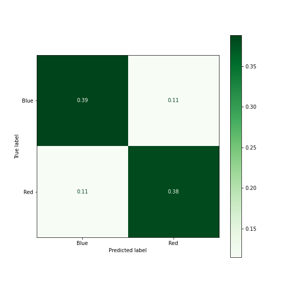

# League of Legends Win Predictor
 
 
**Author: Kyle Weesner**
[github](https://github.com/KyleWeesner)/[linked](https://www.linkedin.com/in/kyleweesner/)/[email](mailto:weesnerkew@yahoo.com)
 


## Overview

This project outlines the process of data collection, using Riots API to train algorithms.  We are doing this to predict the winnability of a game at fifteen mins.  This win predicting model and its app is meant to be used as a time efficient rank climbing helper tool to help more serious gamers.  I'm here to pitch this model to Swift Gaming Company, to be used in the Blitz App for gamers.  This model will be used side by side as a win predictor tool.  

## Business Problem

Playing ranked games of League of Legends can take consumable amount of time.  An average game can take between thirty to forty minutes.  At the fifteen minute mark, you have the option to surrender.  My model will predict whether your team will win or not at the fifteen minute mark.  Being able to know if you're going to win the match or not can save time for the losing team.  The losing team will have the option to surrender instead of playing the remainder of the game.  This app will be important for serious gamers who want to get in as many games possible in hope to maximize the amount of wins per gaming session.

 
## Data
Data was acquired through [Riots Developer Portal](https://developer.riotgames.com/).  An account with Riot is required along with agreeing with their general policies to have access to their API key.  Functions for data collection are located in `data_gathering_functions.py` and the process for collecting my dataset is located [Web_scraping_for_Final_Dataset](https://github.com/KyleWeesner/Catpstone-exploration/blob/main/Untitled_Folder/Web_scraping_for_Final_Dataset.ipynb). Match data were collected in season twelve.

Features that went into the model were:
- Kills
- VisionScore 
- Assists
- CS 
- Levels
- Number Dragons Slayed
- Types of Dragons Slayed (Earth, Fire, Air, Hextech, Water)
- Number of Rift Heralds Slayed
- Number of Turrets Destroyed
- Number of Inhibitors Destroyed

 
## Tools
The predictive models were made with a combination of the data and the tools listed below:
- Pandas for data frame manipulation and data analysis.  
- Sklearn for statistical modeling and machine learning.
- Streamlit for app building.  

## Navigation

Follow these notebooks in order for the workflow.

1. [Web scraping/ Data Collection](https://github.com/KyleWeesner/Catpstone-exploration/blob/main/Web_scraping_for_Final_Dataset.ipynb)

2. [Model Building](https://github.com/KyleWeesner/Catpstone-exploration/blob/main/Modeling.ipynb)


## Results
There were many types of algorithms that were used for modeling.  The algorithms used were chosen because they predict on binary classification and were recommended to use for my data size.  Many of the top performing models had relatively the same cross-val scores.  It appears that there may be a cap for how well my models can predict.  Most of my models were around the same accuracy, so more features may be needed for improving my model performance.  Because League of Legends is constantly updating their gameplay, some of my models will need to be re-trained depending on the season or update. 


Deciding on the final model for the app was based on how fast the model was able to predict on the testing data.  It is important on giving the users of the app quick results.  Out of my top performing models LogisticRegression had the faster computational speed out of the models. 


&nbsp;


The final model's accuracy score on the test set was 0.77.  The data was split about 50/50 on the winning percentage between the blue team and the red team.  This was great because playing on the left side or the right side of the map had no bias to influence the chance of winning the game.  




## App Deployment

Due to legal agreements this app will not be publicaly available on a website until the product gets registered and approved by Riot Games.

The app can be ran locally from the app.py file with streamlit. You select what team you are on.   It takes in multiple statistics about both teams.  All of these numbers can be acquired for the user at any point of the game. Then you can get a prediction that returns your percentage of winning the game


## Conclusion
My model can be a useful application in the Blitz App for League of Legend gamers who are wanting to play a ranked match while being efficient with their time.  The final model used was a LogististicRegression Algorithm with a 77% accuracy on unseen data.


## Repository Structure
```
├── data
├── images
├── workspace
│       ├── App_Construction.ipynb
│       ├── creating_functions_for_Live_data.ipynb
│       ├── Developing_functions.ipynb
│       ├── Initial_api_exploration.ipynb
│       ├── best_model_logreg_T
│       ├── data_gathering_functions.py
│       └── matchId.txt
├── .gitignore
├── Modeling.ipynb
├── README.md
├── Web_scraping_for_Final_Dataset.ipynb
├── app.py
├── data_gathering_functions.py
├── environment.yml
└── presentation.pdf
```
 
### Next Steps

- Get more features for dataframe in hope to get better performance metrics

- Expand model to all player ranks

- Develop functions for the app to gather live game data so the user will not need to input every feature

- Develop a prediction tool that live updates the winning percentage as the game progresses


Citation:
https://wallpaperaccess.com/full/217097.jpg

League of Legends Win Predictor isn't endorsed by Riot Games and doesn't reflect the views or opinions of Riot Games or anyone officially involved in producing or managing Riot Games properties. Riot Games, and all associated properties are trademarks or registered trademarks of Riot Games, Inc.
